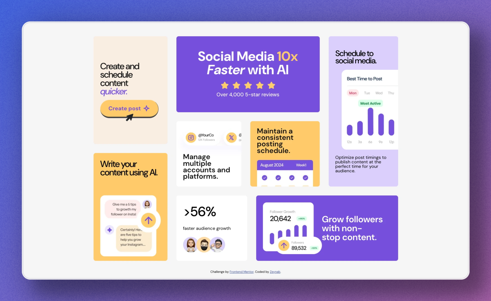

# Frontend Mentor - Bento Grid Solution

This is my solution to the [Bento Grid challenge on Frontend Mentor](https://www.frontendmentor.io/challenges/bento-grid-RMydElrlOj). This project helped me refresh my CSS Grid and animation skills while building a responsive layout.

## Table of Contents

- [Overview](#overview)
  - [The Challenge](#the-challenge)
  - [Screenshot](#screenshot)
  - [Links](#links)
- [My Process](#my-process)
  - [Built With](#built-with)
  - [Continued Development](#continued-development)
  - [Useful Resources](#useful-resources)
- [Author](#author)
- [Feedback](#feedback)

## Overview

### The Challenge

Users should be able to:

- View an optimal layout for the interface depending on their screen size
- Experience smooth animations that enhance the UI

### Screenshot

Here’s a preview of the project:

### Links

- **Solution URL:** [Add solution URL here](https://your-solution-url.com)
- **Live Site URL:** [Add live site URL here](https://your-live-site-url.com)

## My Process

### Built With

- **HTML**
- **CSS** (Custom properties, CSS Grid, Animations)
- **JavaScript** (Vanilla JS for entering grid items on Load)
- **Vite** (for fast development)
- **Mobile-first workflow**

### Continued Development

Going forward, I want to:

- Explore more advanced animation techniques
- Optimize CSS animations for better performance
- Experiment with GSAP for complex animations

### Useful Resources

- [Bento grid examples](https://bentogrids.com/?category=animation) – Ideas for bento grid animations
- [MDN Web Docs - CSS Animations](https://developer.mozilla.org/en-US/docs/Web/CSS/CSS_Animations/Using_CSS_animations) – Helped refine my animation approach.
- [Grid Playground](https://flexboxlabs.netlify.app/grid) – A great interactive tool for practicing CSS Grid.
- [PostSpark](https://postspark.app/), An online tool to create beatufule screenshots & mockups

## Author

- **Website:** [Your Name](https://your-website.com)
- **Frontend Mentor:** [@yourusername](https://www.frontendmentor.io/profile/yourusername)
- **Twitter:** [@yourusername](https://twitter.com/yourusername)

## Feedback

I’d love feedback on the animations, especially on how they enhance the user experience. Let me know if anything can be improved! 🚀
